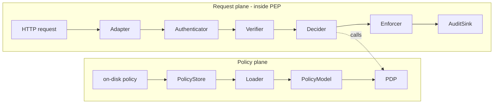
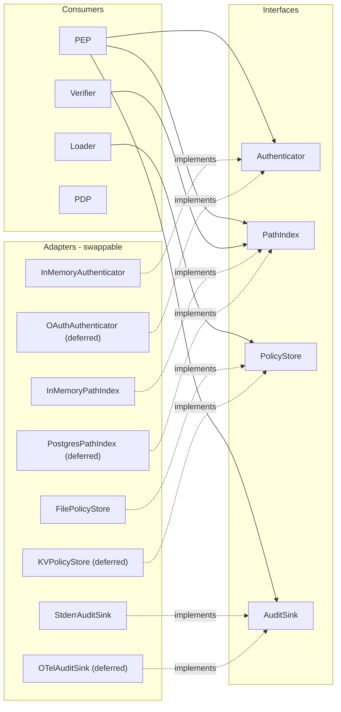
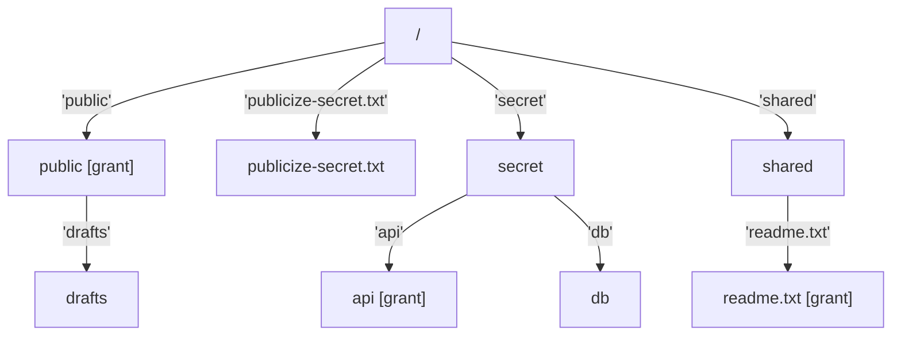
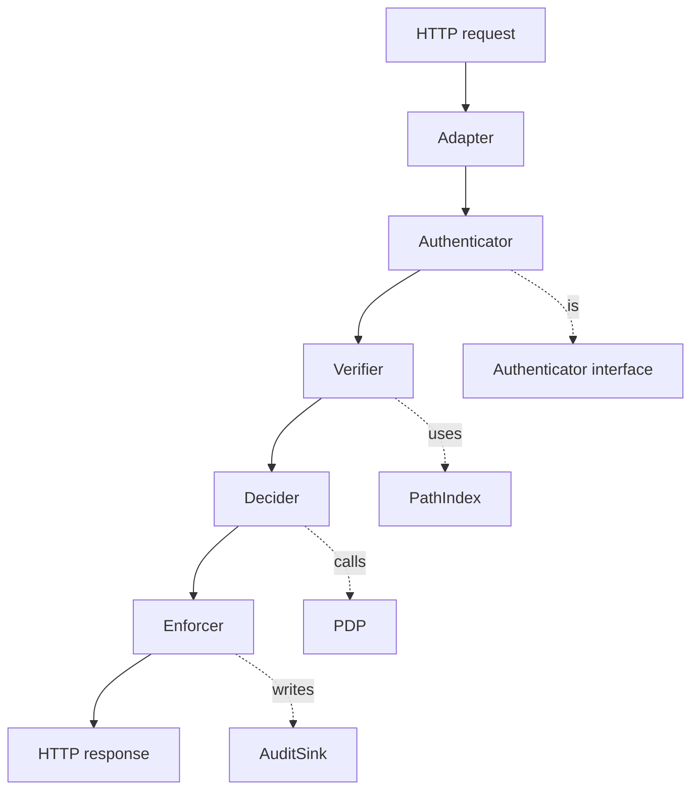
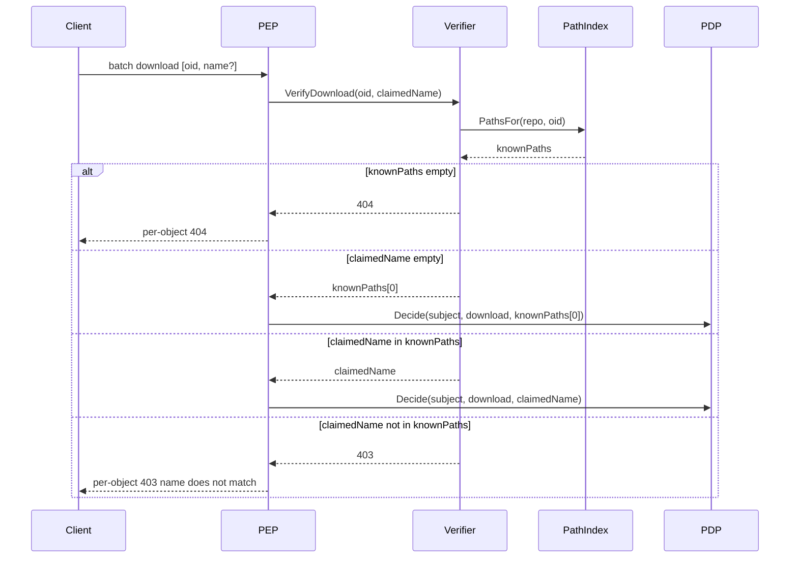
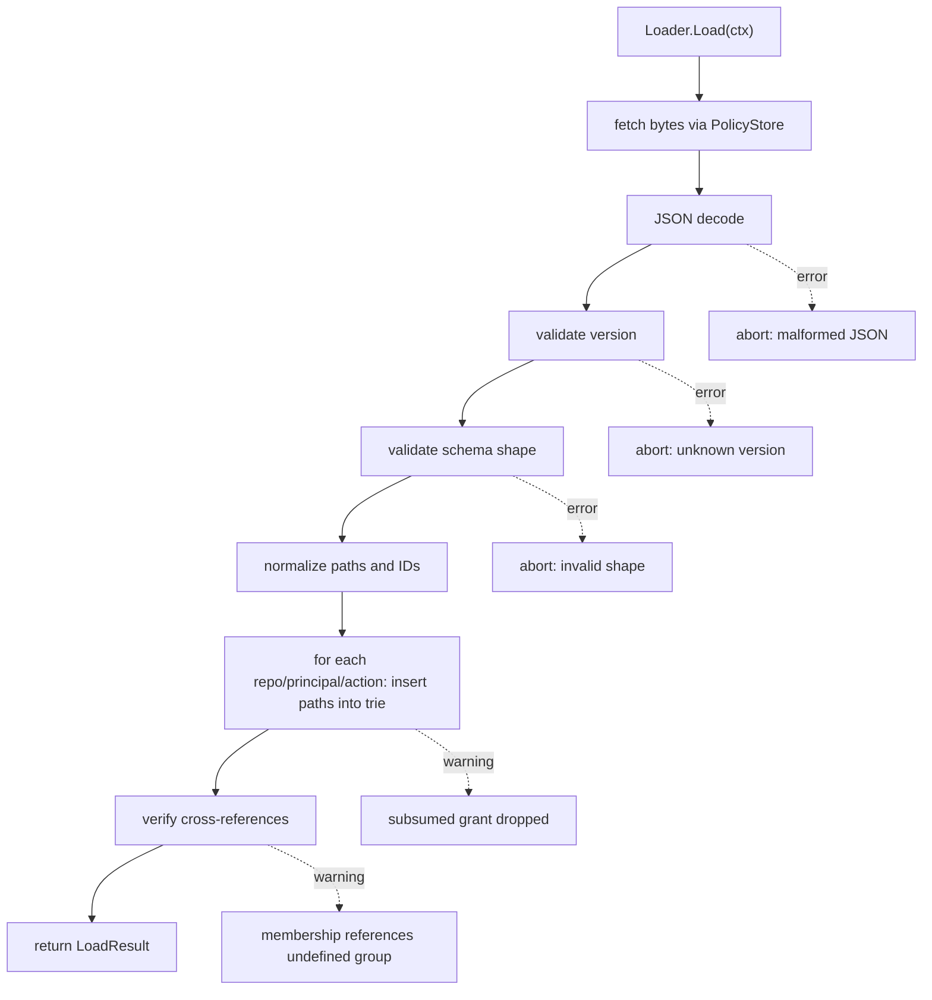

# LFS server authorization: PDP, PEP, Verifier, Loader

Self-contained design for the authorization subsystem of the custom LFS server. Implementation-ready. Backs the "Design settled" references in [docs/proposals/components.md](docs/proposals/components.md) sections 2.1-2.5.

This doc records decisions, not deliberation. The multi-session design conversation that produced these decisions lives in chat history.

## 1. Goals, non-goals, audience

**Goals.** Settle the design for path-level authorization in the custom LFS server so implementation can begin without further design conversations. Specifically, fix the contracts for the Policy Decision Point (PDP), the Policy Enforcement Point (PEP), the Verifier, the Loader, and the interfaces that connect them.

**Non-goals.** This doc does not cover:

- Authentication mechanics (token formats, OAuth flows, mTLS). The `Authenticator` is named but its implementations are out of scope.
- The Diff Service, the webhook bot, and the read-side ACL on rendered diffs. See [docs/proposals/components.md](docs/proposals/components.md) sections 3 and 5.
- Pre-receive hooks and write-side ACL outside the LFS Batch API. See [docs/proposals/components.md](docs/proposals/components.md) section 6.
- Encryption at rest, locks API, audit log retention/shipping, browser UI augmentations. All deferred per [docs/proposals/components.md](docs/proposals/components.md) section 7.

**Audience.** A developer starting fresh on the LFS server. This doc should be sufficient on its own.

## 2. Architecture overview and design principles

The system has two planes that meet at the PDP.



Policy plane: durable at startup, immutable while serving. Request plane: ephemeral, processes one HTTP request at a time.

### 2.1 Design principles

Five principles, referenced throughout this doc.

1. **Dependency Inversion.** Every component depends on interfaces defined in terms of its own business needs, never on concrete storage, network, or infrastructure types. The server must be fully runnable, testable, and debuggable using only in-memory implementations of those interfaces. Production backends (Postgres, S3, OTel, etc.) are *adapters* added at deploy time, not constraints baked into the design.
2. **Pure core, dirty edges.** The PDP and the segment trie are pure functions over plain values. All I/O, time, and randomness lives in the PEP and in adapters. Makes the core trivially testable and the edges swappable.
3. **Fail closed, fail loud.** Malformed policies refuse to load; missing interface implementations refuse to start; decisions with unavailable inputs deny. Never silently default-open.
4. **Allow-only, first-match-wins.** Rules grant. Absence of a matching grant is denial. No effect-combining algorithms, no explicit deny rules, no priorities.
5. **Identity is not policy.** Principal membership is supplied by the PEP from an external identity layer. The PDP only sees a flat principal list. Replacing the identity source never changes a line of PDP code.

### 2.2 Dependency direction

The load-bearing diagram. Arrows point from "depends on" to "what is depended on". Nothing crosses directly from a consumer to a concrete adapter.



The PDP has no external dependencies at all. Consumers import only the interface column. Adapters are wired in by `main.go` at startup; tests construct their own (usually in-memory).

## 3. Key terms

| Term | Definition |
| --- | --- |
| Subject | Acting identity for a request, including all principals it acts as. |
| Principal | A named source of grants: a user, group, or service account. Identified by a prefixed string. |
| Action | A verb: `upload`, `download`. Later: `delete`, `verify`, `lock`. |
| Resource | What is acted on: `(repo, path)`. |
| Request | Input to the PDP: `(Subject, Action, Resource)`. |
| Decision | Output of the PDP: `(Effect, Source, MatchedRule, Reason)`. |
| Grant | A subtree path that a principal is permitted to act on for a given action. |
| Trie node | A node in the per-(principal, repo, action) segment trie. Marked or unmarked as a grant point. |
| PDP | Policy Decision Point. Pure function `Decide(policy, request) -> decision`. |
| PEP | Policy Enforcement Point. The HTTP handler. Calls the PDP and enforces the result. |
| Verifier | Component that converts client-claimed paths into trusted paths via the OID-name index. |
| Loader | Component that reads on-disk policy bytes via `PolicyStore`, validates, builds the in-memory model. |
| PolicyModel | Validated in-memory policy: repos -> principals -> per-action trie of grants. |

## 4. Component interfaces (the dependency seams)

Placed early on purpose. These interfaces are the contracts every later section depends on. Defining them up front makes Dependency Inversion impossible to lose sight of.

For each interface: the Go shape (sketch only), what callers can assume, the in-memory implementation that ships in v1, and the production candidates (explicitly deferred).

**Dependency direction rule.** No concrete adapter type ever appears in a PDP/PEP/Verifier/Loader signature. If something shows up there, it is the interface, not the implementation. The compiler enforces this if adapters live in separate packages.

### 4.1 Authenticator

```go
// Shape, not final code.
type Authenticator interface {
    Authenticate(r *http.Request) (Subject, error)
}
```

**Contract.** Returns a fully-resolved `Subject`, including transitively-flattened group memberships, or an error if the request bears no valid credentials. Anonymous access returns `Subject{Principals: []string{"anonymous"}}` with nil error -- not an error. Caller treats any non-nil error as 401.

**In-memory implementation (v1).** `InMemoryAuthenticator` matches HTTP Basic credentials against a static `map[string]userRecord` populated at startup. Each record carries the user's group memberships verbatim.

**Deferred.** OAuth/JWT authenticator that resolves token claims to user + groups via an identity provider. mTLS authenticator that maps client cert subject DN to principal.

### 4.2 PathIndex

```go
// Shape, not final code.
type PathIndex interface {
    Record(repo, oid, path string) error
    PathsFor(repo, oid string) ([]string, error)
}
```

**Contract.** `Record` is idempotent under set semantics: recording the same `(repo, oid, path)` twice is a no-op. `PathsFor` returns every path the OID has been recorded at in this repo; order is unspecified but stable across calls within a process. Errors are infrastructure failures, not "not found". An unknown OID returns an empty slice with nil error.

**In-memory implementation (v1).** `InMemoryPathIndex` wraps `map[repoOIDKey]map[string]struct{}` with an `sync.RWMutex`. Fits in a few dozen lines.

**Deferred.** `SQLitePathIndex` for single-file persistence. `PostgresPathIndex` for production scale.

### 4.3 PolicyStore

```go
// Shape, not final code.
type PolicyStore interface {
    Load(ctx context.Context) ([]byte, error)
    Watch(ctx context.Context) (<-chan struct{}, error) // optional; nil channel if unsupported
}
```

**Contract.** `Load` returns the raw policy bytes. The Loader parses; the store does not. `Watch` (optional) emits a signal whenever the underlying source changes, so the server can trigger a hot reload.

**In-memory implementations (v1).** `FilePolicyStore` reads from a filesystem path; `Watch` uses `os.Stat`-based polling on a short interval. `StringPolicyStore` returns a fixed byte slice -- used exclusively in tests.

**Deferred.** KV-backed or config-service-backed store with native change notifications.

### 4.4 AuditSink

```go
// Shape, not final code.
type AuditSink interface {
    Record(entry AuditEntry) // never blocks, never errors
}

type AuditEntry struct {
    Timestamp time.Time
    RequestID string
    Subject   string   // principal that authenticated, e.g. "user:alice"
    Action    string
    Repo      string
    Path      string
    OID       string
    Effect    string   // "permit" or "deny"
    Source    string   // matched principal; "" on deny
    Reason    string
}
```

**Contract.** Fire-and-forget. The sink owns its own buffering, back-pressure, and error handling. The PEP never waits on it. Deliberate choice: audit must never delay a request.

**In-memory implementation (v1).** `StderrAuditSink` writes one JSON line per entry to stderr.

**Deferred.** `OTelAuditSink`, `SyslogAuditSink`, file-rotating sink with shipping to ELK/Loki/equivalent.

### 4.5 ObjectStore (called out, not designed here)

The PEP eventually needs an `ObjectStore` interface to mint pre-signed upload/download URLs. v1 implementation is local filesystem. Production candidate is S3/MinIO. Full design lives in a separate doc; see [docs/proposals/components.md](docs/proposals/components.md) section 4.

## 5. The Policy Decision Point (PDP)

**Depends on.** Nothing external. Pure function over `Policy` and `Request` values. No interfaces. Honors principle 2.

### 5.1 Contract

```go
// Shape, not final code.
func Decide(p *Policy, req Request) Decision
```

Pure function. Same inputs, same output. No I/O, no globals, no time. No panics on bad input -- validation happens at load time.

### 5.2 Types

```go
// Shape, not final code.
type Subject struct {
    Principals []string // ["user:alice", "group:engineers", "group:all-employees"]
}

type Action string // "upload", "download", later "delete", "verify"

type Resource struct {
    Repo string
    Path string
}

type Request struct {
    Subject  Subject
    Action   Action
    Resource Resource
}

type Effect int

const (
    Permit Effect = iota
    Deny
)

type Decision struct {
    Effect      Effect
    Source      string // matching principal (e.g. "group:engineers"); "" if deny
    MatchedRule string // stable rule ID; "" if deny
    Reason      string // human-readable
}

type Policy struct {
    Repos map[string]*RepoPolicy
}

type RepoPolicy struct {
    Principals map[string]*PrincipalGrants // "user:alice" -> grants
}

type PrincipalGrants struct {
    Tries map[Action]*Trie // one trie per action
}
```

Reserved-for-later, not in v1: `Resource.Ref` (refs as an authorization dimension) and `Request.Environment` (time/IP-conditional rules).

### 5.3 The algorithm

```go
// Shape, not final code.
func Decide(p *Policy, req Request) Decision {
    rp, ok := p.Repos[req.Resource.Repo]
    if !ok {
        // Ungoverned repos: the PEP short-circuits before calling us.
        // If we are called anyway, fail closed.
        return Decision{Effect: Deny, Reason: "repo not in policy"}
    }
    for _, name := range req.Subject.Principals {
        pg := rp.Principals[name]
        if pg == nil { continue }

        t := pg.Tries[req.Action]
        if t == nil { continue }

        if gid, ok := t.Decide(req.Resource.Path); ok {
            return Decision{
                Effect:      Permit,
                Source:      name,
                MatchedRule: gid,
                Reason:      "permitted by " + name,
            }
        }
    }
    return Decision{Effect: Deny, Reason: "no grant matched any principal"}
}
```

About 15 lines. The body cannot grow much; everything else lives elsewhere.

### 5.4 Per-principal evaluation

Walk `Subject.Principals` in order. The first principal whose trie says PERMIT terminates the loop. Order matters only for which `Source` is attributed -- the allow/deny outcome is order-independent because semantics are union (any permit means permit).

Convention: principals are ordered most-specific first -- `user:<id>` before `group:<...>`, narrower groups before broader. Audit logs then attribute access to the user's own grant when one exists, falling back to groups.

### 5.5 What the PDP must not do

| Forbidden | Rationale |
| --- | --- |
| File I/O | Policy is already in memory. If it is not, that is the caller's problem. |
| Network calls | Subject's groups are already in `Subject.Principals`. |
| Reading globals | Output depends only on arguments. |
| Wall-clock time | Time-sensitive rules require time in the input. |
| Mutation of `Policy` or `Request` | Pure means pure. |
| Logging | Caller decides what to do with a decision. |
| Panics on inputs | Validation runs at policy load; PDP can assume `Policy` is well-formed. |

### 5.6 Why no version, OID, ref, or environment in v1

- **Version**: OIDs are content-addressed; the OID *is* the version. The PDP authorizes against names, not contents.
- **OID**: not authorization input. Used by the Verifier (one layer up) to verify the name claim.
- **Ref**: download protocol does not carry a meaningful ref. Upload could, but branch-protection rules are a separate feature. Reserved field, not implemented.
- **Environment**: YAGNI. Time/IP-conditional rules need careful design (audit reproducibility, test determinism). Add when a concrete need arrives.

## 6. Path matching: segment tries

**Depends on.** Nothing external. Pure data structure over plain strings. Honors principle 2.

### 6.1 Segment, not character

Patterns match path *components*, not raw character prefixes. A grant on `public/**` permits `public/drafts/foo.bin` but not `publicize-secret.txt`. Character-level prefix matching gets this wrong; segment-level matching gets it right by construction.



A query path is split on `/` into segments. Each edge is labelled with a whole segment. Walking down from root, the first node marked as a grant point answers PERMIT.

### 6.2 Subtree-only grants

The supported pattern language is intentionally restricted:

- `**` -- everything under root.
- `<prefix>/**` -- everything under `<prefix>/`. Encoded by marking the `<prefix>` node.
- `<exact-path>` -- a single fully-qualified path. Encoded by marking that leaf.

No globs inside segments. `*.bin`, `src/*/api/**`, `**/*.go` are not supported. This restriction is what makes the trie work: every grant maps to a single node.

Documented loudly. The vast majority of real authorization patterns fit; the rest are usually trying to do something they should not.

### 6.3 Non-overlapping grants invariant

Within a single per-(principal, repo, action) trie, no two grants are in a subtree relationship. If a policy file declares both `public/**` and `public/drafts/**` for the same principal+action, the Loader detects the subsumption and drops the redundant grant, emitting a warning.

This invariant gives two benefits:

- A query path matches at most one grant. "First match wins" reduces to "the only match wins"; rule order is meaningless within a trie.
- "Effective access" is canonical: the set of marked nodes is the full answer.

### 6.4 Operations

```go
// Shape, not final code.
type Trie struct {
    root *trieNode
}

type trieNode struct {
    grant    string                 // grant ID; empty means not a grant point
    children map[string]*trieNode
}

// Insert marks `path` as a granted subtree. Returns the grant ID assigned,
// or empty + warning if the grant is subsumed by an existing one.
func (t *Trie) Insert(path string, id string) (effectiveID string, warning string)

// Decide walks `path` from root. Returns the first grant ID encountered,
// or "" and false if no grant matched.
func (t *Trie) Decide(path string) (id string, ok bool)
```

Both operations are O(d) where d is the path's segment depth. Typical d is 3-5 for real paths.

### 6.5 Path normalization

Performed at Insert AND at Decide with the same rules:

- Split on `/`, drop empty segments produced by leading/trailing/double slashes.
- Reject `..` segments outright (path traversal protection, defense in depth).
- Treat `**` as the path with zero segments -- the root grant marks the root node.
- Case-sensitive throughout.

A path that fails normalization is a load-time error in the Loader (for grants) or a verification-time error in the PEP (for client claims).

## 7. Principals

**Depends on.** Nothing in the PDP. The PEP supplies `Subject.Principals` already populated.

### 7.1 The unification

Users, groups, and service accounts are all the same thing from policy's point of view: **principals**, each a named bag of grants. The PDP does not distinguish them.

Principal IDs use a type prefix to keep namespaces separate:

| Prefix | Meaning | Example |
| --- | --- | --- |
| `user:` | A human user | `user:alice` |
| `group:` | A named group of users | `group:release-engineers` |
| `service:` | A service account (machine identity) | `service:diff-renderer` |
| `anonymous` | The unauthenticated subject | `anonymous` (reserved literal, no prefix) |

Collisions impossible by construction: a user named `release-engineers` is `user:release-engineers`; the group is `group:release-engineers`.

### 7.2 Identity is not policy

`Subject.Principals` is built by the PEP from two inputs:

1. The Authenticator's verdict on the request (the user's own ID).
2. A membership lookup (group memberships, transitively flattened).

For the fixture, both sources collapse into a single policy file (section 10). In production, the Authenticator may return membership claims from a JWT, or the PEP may consult an LDAP/SCIM service.

The PDP never sees how membership was resolved. It receives a flat list and walks it. Replacing the identity source -- LDAP for OAuth claims, for example -- never changes a line of PDP code.

### 7.3 Group nesting

Group nesting is resolved by the identity layer before the PDP runs. If `alice` is in `release-engineers`, which is in `engineers`, which is in `all-employees`, then `Subject.Principals = ["user:alice", "group:release-engineers", "group:engineers", "group:all-employees"]` when the PEP calls the PDP.

The PDP does not recurse. It does not consult a group-of-groups index. It walks the flat list and stops.

### 7.4 Audit provenance

Every `Decision` carries `Source` -- the principal whose trie matched. This is the single most useful audit field: it answers "why did Alice have access?" in one log line.

## 8. The Policy Enforcement Point (PEP)

**Depends on.** `Authenticator`, `PathIndex`, `AuditSink`, plus the in-process `Policy` snapshot the Loader produces. Never on concrete storage or network types. Honors principles 1, 2, 3.

### 8.1 What it is

The boundary between protocol concerns (HTTP, LFS Batch JSON, status codes, headers, audit) and decision concerns (`Subject`, `Action`, `Resource` -> `Decision`).

Where the PDP is pure, the PEP is where I/O happens: parsing, authenticating, verifying, calling the PDP, assembling responses, logging.

### 8.2 The five jobs

In a single batch request, in order:

1. **Authenticate.** Call `Authenticator.Authenticate(r)` -> `Subject`. On error, 401.
2. **Parse.** Decode the LFS batch JSON into structured `{oid, name, size}` records. Defensive parsing; 400 on malformed input.
3. **Verify.** For each object, convert the client's claimed `(oid, name)` into a trusted path -- consulting `PathIndex` for downloads, accepting the claim for uploads. See section 9.
4. **Decide.** For each verified record, build a `Request` and call `PDP.Decide`. Collect every decision before responding -- the audit log wants the full set.
5. **Enforce.** Translate the decisions into a batch response, applying direction-specific atomicity rules.

### 8.3 Internal layering



The top-level `batchHandler` is an 8-10 line orchestration:

```go
// Shape, not final code.
func (s *Server) batchHandler(w http.ResponseWriter, r *http.Request) {
    parsed, err := s.adapter.Parse(r)
    if err != nil { http.Error(w, err.Error(), 400); return }

    subject, err := s.authn.Authenticate(r)
    if err != nil { http.Error(w, "unauthorized", 401); return }

    verified, errs := s.verifier.VerifyBatch(parsed, subject)
    decisions := s.decider.DecideAll(s.policy.Get(), subject, verified)
    s.enforcer.Respond(w, parsed.Operation, verified, decisions, errs)
    s.audit.RecordAll(subject, parsed, decisions)
}
```

Every interesting decision lives inside one of the named components, where it can be tested in isolation.

### 8.4 Direction-specific atomicity

The PDP's per-object decisions are combined differently for the two directions.

| Direction | Behavior on mixed allow/deny | Wire shape |
| --- | --- | --- |
| Download | Per-object enforcement. Allowed objects get download URLs; denied get `{error: {code: 403, ...}}`. Batch returns 200. | Per-object errors inside a 200 batch response. Matches the existing `feat/auth-read` work. |
| Upload | All-or-nothing. Any deny rejects the entire batch with a top-level 403. No upload actions minted. | Top-level `{message: "..."}` 403. Matches the existing `feat/auth-write-atomic` work. |

Why different: downloads can be partial because the client can skip-and-continue meaningfully (`lfs.skipdownloaderrorcodes`). Uploads cannot, because pushing a Git commit with only some of its LFS objects creates orphans on the server.

The PDP is unaware of this asymmetry. It answers per-object questions. The PEP knows protocol semantics and composes the answers into a per-direction response.

### 8.5 What the PEP must not do

| Forbidden | Rationale |
| --- | --- |
| Implement policy logic itself | That is the PDP. If the PEP starts saying "well, except in this case, allow anyway", layering is lost. |
| Cache decisions across requests | Decisions are O(d). Cache invalidation cost exceeds recomputation. Stale "permit" after revocation is a security bug. |
| Silently allow on PDP/Authenticator/PathIndex unavailability | Fail closed. Principle 3. |
| Trust client claims without the Verifier | The whole point of the Verifier. |
| Conflate 401 (authn) and 403 (authz) | Different errors, different code paths, different logs. |
| Import a database driver, an S3 client, or any infrastructure SDK | These belong in adapter packages. Principle 1. The compiler enforces this if adapters live in separate packages. |

## 9. The Verifier and the OID-name binding

**Depends on.** `PathIndex` interface only. The Verifier never reads from disk or DB directly.

### 9.1 Why the Verifier exists

The PDP authorizes against paths. Paths come from client claims (the `name` field in the LFS batch request). If the client can lie about the name and have the lie believed, path-level authorization is fictional.

The Verifier closes that gap. Its job: turn a client-claimed `(oid, name)` into a trusted path, or refuse the request.

### 9.2 The fundamental asymmetry

> **Uploads establish bindings. Downloads consult them.**

Intrinsic to content-addressed storage. The OID is a hash of content; the path is metadata. Before an upload, no server-side fact connects this OID to that path. After an upload completes, the binding `(repo, oid, path)` is recorded. Downloads consult that record.

### 9.3 Upload flow

```mermaid
sequenceDiagram
    participant C as Client
    participant P as PEP
    participant V as Verifier
    participant D as PDP
    participant I as PathIndex
    participant S as ObjectStore

    C->>P: batch upload [oid, name]
    P->>V: VerifyUpload(oid, name)
    Note over V: trivial; no index lookup
    V-->>P: name accepted as claim
    P->>D: Decide(subject, upload, name)
    D-->>P: Permit or Deny
    alt any Deny
        P-->>C: top-level 403, no actions
    else all Permit
        P-->>C: 200 with upload URLs
        C->>S: PUT bytes
        C->>P: /verify endpoint
        P->>I: Record(repo, oid, name)
        Note over I: binding exists now
    end
```

Recording happens **after** the upload succeeds, via `/verify` or a storage callback. Pre-recording would leave phantom bindings for failed uploads.

### 9.4 Download flow



Strict verification. Client lies are detected and rejected.

### 9.5 Edge cases and rules

- **Empty `name` on upload**: reject (400). Uploads must claim a name; that is the binding being established.
- **Path normalization**: same rules as section 6.5, applied at both Record and PathsFor. Bad paths rejected at write time.
- **Cross-repo isolation**: the index key is `(repo, oid)`. A binding in repoA never authorizes a download in repoB, even for the same OID.
- **Concurrency**: append-only set semantics. Two concurrent uploads of the same OID at different paths both succeed. `RWMutex` on the in-memory map; `INSERT ... ON CONFLICT DO NOTHING` in a SQL adapter.
- **Lifecycle invariant**: bindings outliving content is a GC bug. Whatever GCs orphaned objects must also delete their bindings.
- **Multi-path warning**: if `PathsFor` returns more than one path and the client supplied no name, log a warning. Behavior remains deterministic (`knownPaths[0]`); the audit captures the ambiguity.

### 9.6 The verification helper

The strict-verification logic is a small helper at the PEP layer, not part of the `PathIndex` interface. The interface stays minimal:

```go
// Shape, not final code. Lives in the PEP package.
func VerifyDownloadClaim(idx PathIndex, repo, oid, claimed string) (path string, status int, err error) {
    paths, err := idx.PathsFor(repo, oid)
    if err != nil { return "", 500, err }
    if len(paths) == 0 { return "", 404, errUnknownOID }
    if claimed == "" { return paths[0], 200, nil }
    for _, p := range paths {
        if p == claimed { return claimed, 200, nil }
    }
    return "", 403, errNameMismatch
}
```

Means the strict-vs-permissive choice lives in one testable place. Flipping it later changes one function.

## 10. On-disk policy format and the Loader

**Depends on.** `PolicyStore` interface (where bytes come from). The Loader never opens files directly.

### 10.1 File format: JSON

JSON, for boring-but-correct reasons:

| Format | Pro | Con |
| --- | --- | --- |
| JSON | Ubiquitous; unambiguous types; LFS protocol is JSON; mature schema tools | No comments |
| YAML | Comments; "friendly" | Norway problem; tab sensitivity; multiple valid parses; parser version drift |
| TOML | Comments; clean for flat structures | Awkward for nested maps; we have nesting |

If comments become necessary, switch to JSONC (JSON with `//` and `/* */`). Most JSON tooling tolerates it. No structural change required.

### 10.2 Worked example

```json
{
  "version": 1,
  "memberships": {
    "user:alice": ["group:engineers"],
    "user:bob":   ["group:engineers", "group:admins"],
    "user:carol": ["group:all-employees"]
  },
  "repos": {
    "myrepo": {
      "principals": {
        "user:alice": {
          "upload":   ["mine/**"],
          "download": ["**"]
        },
        "group:engineers": {
          "upload":   ["src/**", "tests/**"],
          "download": ["src/**", "tests/**", "docs/**"]
        },
        "group:admins": {
          "upload":   ["**"],
          "download": ["**"]
        },
        "anonymous": {
          "download": ["public/**"]
        }
      }
    },
    "publicrepo": {
      "principals": {
        "anonymous": { "download": ["**"] }
      }
    }
  }
}
```

Reading off effective access:

- **alice in myrepo**: own grants plus engineer grants. Uploads: `mine/**`, `src/**`, `tests/**`. Downloads: `**` (own grant subsumes everything).
- **bob in myrepo**: engineer plus admin. Admin's `**` subsumes everything.
- **carol in myrepo**: `all-employees` has no grants here; no individual entry. Denied everything.
- **anonymous**: `public/**` on myrepo, everything on publicrepo.

### 10.3 Schema rules

| Rule | Enforcement |
| --- | --- |
| `version` present and known (currently `1`) | Loader error |
| Principal IDs match `^(user\|group\|service):[a-zA-Z0-9_.-]+$` or are exactly `anonymous` | Loader error |
| Paths have no leading `/`, no trailing `/`, no `..`, no globs inside segments | Loader error |
| Action names in supported set (`upload`, `download`; later `delete`, `verify`) | Loader error |
| No wildcard action (`"*"` as action key) | Loader error -- avoids accidental scope creep when new actions are added |
| Subsumed grants within (principal, action) | Loader warning -- redundant grant dropped |
| Membership references a group not declared as `group:` anywhere | Loader warning |

Typos in action names surface at server startup, not on the first request that should have used them.

### 10.4 Memberships placement

Memberships sit top-level (next to `repos`), not inside a repo. Group membership is a global identity fact ("alice is an engineer"), not a per-repo policy fact.

**Memberships are not part of `PolicyModel`.** They are a sidecar in `LoadResult`, consumed by the PEP, never by the PDP:

```go
// Shape, not final code.
type LoadResult struct {
    Policy      *PolicyModel
    Memberships map[string][]string // optional; nil when IdP supplies them
    Warnings    []Warning
}
```

This boundary lets a production deployment ignore the file's `memberships` block entirely and resolve groups from LDAP/SCIM/JWT instead. The Loader and PDP are untouched.

### 10.5 The Loader's flow



**Fail-loud rules.** Unknown version, malformed JSON, bad action name, bad path syntax -- all abort the load. The server refuses to start with a broken policy. Never default-open.

**Warn-and-continue rules.** Subsumed grants, undefined-group references, principals with zero effective grants -- collected into `Warnings` alongside the otherwise-valid `LoadResult`.

### 10.6 Future: JSON Schema

A `docs/proposals/auth-policy.schema.json` file is a small follow-up: roughly 50 lines covering required keys, version enum, ID patterns, path patterns, action enum. Benefits: CI validates policy files before merge; editors give autocomplete and inline errors. Not v1; mentioned so it does not get forgotten.

## 11. Worked end-to-end example

Two requests against the policy from section 10.2, using only in-memory adapters.

### 11.1 Allowed download

`alice` requests download of `mine/secret.bin` (OID `abc123`) from `myrepo`.

| Layer | What happens |
| --- | --- |
| Adapter | Parses LFS batch: `{operation: "download", objects: [{oid: "abc123", name: "mine/secret.bin"}]}` |
| Authenticator | HTTP Basic `alice:secret`. `InMemoryAuthenticator` returns `Subject{Principals: ["user:alice", "group:engineers"]}` |
| Verifier | `idx.PathsFor("myrepo", "abc123")` returns `["mine/secret.bin"]`. Claim matches. Trusted path: `mine/secret.bin` |
| Decider | `PDP.Decide` walks `user:alice` first. Trie for `download` has `**` marked at root. Returns Permit with `Source="user:alice"` |
| Enforcer | Mints a download URL via `ObjectStore`. Returns 200 with `{objects: [{actions: {download: {href: ...}}}]}` |
| Audit | Records `{effect: "permit", source: "user:alice", path: "mine/secret.bin", ...}` |

### 11.2 Denied mixed-batch upload

`alice` pushes a commit containing `mine/draft.bin` (allowed) and `secret/db.bin` (denied).

| Layer | What happens |
| --- | --- |
| Adapter | Parses: `{operation: "upload", objects: [{oid: "a1", name: "mine/draft.bin"}, {oid: "b2", name: "secret/db.bin"}]}` |
| Authenticator | Same -- `Subject{Principals: ["user:alice", "group:engineers"]}` |
| Verifier | Upload direction: no PathIndex lookup. Both names accepted as claims. |
| Decider | `mine/draft.bin`: walks `user:alice.Tries[upload]`. `mine` is marked. Permit. `secret/db.bin`: walks `user:alice.Tries[upload]` -- no `secret` subtree. Walks `group:engineers.Tries[upload]` -- has `src`, `tests`; no `secret`. **Deny.** |
| Enforcer | Direction is upload, any deny -> top-level 403. Body: `{message: "policy: upload denied; user 'user:alice' cannot push the following paths to repo 'myrepo': secret/db.bin"}`. **No upload URLs minted for either object.** |
| Audit | Two entries: permit for `mine/draft.bin`, deny for `secret/db.bin`. Request-level outcome (batch rejected) also logged. |

**Every line of code touched is the same in production.** Only the adapters differ: `InMemoryAuthenticator` -> `OAuthAuthenticator`, `InMemoryPathIndex` -> `PostgresPathIndex`, `FilePolicyStore` -> `KVPolicyStore`, `StderrAuditSink` -> `OTelAuditSink`. The PDP, Verifier core, Loader, and PEP orchestration are untouched.

## 12. Testing strategy

The proof that DIP pays off. Three layers, each runnable with zero infrastructure.

### 12.1 Unit tests (pure)

Targets: PDP, trie operations, principal-list walking, path normalization, `VerifyDownloadClaim` helper.

Style: table-driven. No interfaces, no setup, no teardown. Hundreds of cases run in milliseconds.

```go
// Shape, not final code.
func TestDecide(t *testing.T) {
    cases := []struct {
        name    string
        policy  *Policy
        req     Request
        wantEff Effect
        wantSrc string
    }{
        {"empty policy denies",   emptyPolicy(), req("alice", "download", "myrepo", "x"),      Deny,   ""},
        {"user grant matches",    alicePolicy(), req("alice", "download", "myrepo", "mine/x"), Permit, "user:alice"},
        {"group grant matches",   alicePolicy(), req("alice", "download", "myrepo", "src/x"),  Permit, "group:engineers"},
        // ... many more ...
    }
    for _, tc := range cases {
        t.Run(tc.name, func(t *testing.T) {
            got := Decide(tc.policy, tc.req)
            if got.Effect != tc.wantEff || got.Source != tc.wantSrc {
                t.Errorf("got %+v, want effect=%v source=%v", got, tc.wantEff, tc.wantSrc)
            }
        })
    }
}
```

### 12.2 Component tests (in-memory adapters)

Targets: PEP, Verifier, Loader -- each tested with stub or in-memory interface implementations.

Examples:

- **Loader test**: `StringPolicyStore` returning canned JSON. Call `Loader.Load(ctx)`. Assert `LoadResult` shape and warnings. Round-trip a malformed policy and assert the expected error.
- **Verifier test**: pre-populate `InMemoryPathIndex` with `(repo, oid, path)` tuples. Call `VerifyDownloadClaim` with various claims. Assert path, status, error.
- **PEP test**: spin up `httptest.NewServer` wired to in-memory everything. Issue real LFS batch HTTP requests. Assert response body and status. Integration-quality coverage without any external service.

### 12.3 Integration tests (existing shell-test style)

The codebase already uses shell-based integration tests for LFS auth ([t/t-auth-read.sh](t/t-auth-read.sh), [t/t-auth-write.sh](t/t-auth-write.sh)). The same style fits the new server:

- Start the server binary as a subprocess with in-memory adapters and a temp-file policy.
- Run `git lfs` commands against it.
- Assert exit codes, on-disk state, server-side audit lines.

No databases, no message buses, no external dependencies. CI runs them in seconds.

### 12.4 Production adapter tests (separate, deferred)

Production storage adapters (Postgres `PathIndex`, S3 `ObjectStore`, OAuth `Authenticator`, OTel `AuditSink`) get their own tests against real backends in containers. These tests live in separate packages, are tagged with build constraints, and run on a different CI lane.

**They do not block development of the core.** The core can land, be reviewed, and ship with zero database in the loop. The first production-adapter PR can land independently, with its own focused review.

### 12.5 Wiring (dependency injection in practice)

The server's constructor is the only place that names concrete adapters:

```go
// Shape, not final code.
func NewServer(
    authn Authenticator,
    idx   PathIndex,
    store PolicyStore,
    audit AuditSink,
    // ... other interfaces ...
) (*Server, error)
```

A test `main.go` constructs in-memory adapters:

```go
// Shape, not final code, lives in the test entrypoint.
srv, _ := NewServer(
    NewInMemoryAuthenticator(testUsers),
    NewInMemoryPathIndex(),
    NewStringPolicyStore(testPolicyJSON),
    NewStderrAuditSink(),
)
```

A production `main.go` constructs production adapters:

```go
// Shape, not final code, lives in the prod entrypoint.
srv, _ := NewServer(
    NewOAuthAuthenticator(cfg.OAuth),
    NewPostgresPathIndex(cfg.DB),
    NewKVPolicyStore(cfg.KV),
    NewOTelAuditSink(cfg.OTel),
)
```

**The only file that knows both halves of the dependency tree is `main.go`.** Every other file imports the interface package and is oblivious to which adapter it is wired to. That is what makes the swap painless.

### 12.6 Golden-file tests for the Loader

A fleet of valid and invalid policy files under `testdata/`. Each has a corresponding expected `LoadResult` (or expected error). The Loader test walks `testdata/`, runs each file through `Loader.Load`, asserts. Catches accidental format-breaking changes immediately.

## 13. What's explicitly deferred

| Item | Why deferred | When to revisit |
| --- | --- | --- |
| Refs as an authorization dimension | Reserved as future `Resource.Ref` / per-rule field. Download protocol does not carry a meaningful ref; upload could but branch protection is a separate feature. | When write-side branch protection becomes a real ask. |
| Allow + deny effects | Allow-only first-match-wins covers the cases we have. Effects add operator complexity. | When a real "allow X except Y" pattern that cannot be expressed via enumeration shows up repeatedly. |
| Per-grant metadata (expiry, attestation, justification) | YAGNI. Grant strings are simple. | When time-limited grants or per-grant audit trails become a requirement. |
| Lazy trie construction | Eager builds are microseconds-to-milliseconds at load. Memory cost is bounded. Lazy adds cache plus concurrency complexity. | Only if `PolicyModel` actually gets huge in practice. |
| Decision caching at PEP level | Decisions are O(d). Cache invalidation cost exceeds recomputation. Stale caches are a security risk. | Probably never. |
| JSON Schema file | Nice-to-have for CI validation and editor support. Not required for v1. | When the format settles; bundle with the first non-v1 schema bump. |
| Production storage backends | Postgres `PathIndex`, S3 `ObjectStore`, OTel `AuditSink`, OAuth `Authenticator`. Each is a separate adapter PR. | After the core is in place and being exercised. |
| Encryption at rest, audit retention, locks API | Cross-referenced to [docs/proposals/components.md](docs/proposals/components.md) section 7. | Per the prioritization in that doc. |
| Seamless mixed-access checkout | The forked client already maps a per-object download `403` to a `DownloadDeclinedError` and re-emits the pointer (see `tq/transfer_queue.go` `shouldTreatAsDeclined` and `commands/command_smudge.go`), gated on `lfs.skipdownloaderrorcodes`; the server already returns `403` on a download denial (`internal/pep/enforcer.go`). What's missing is wiring standard LFS endpoint discovery + a git credential helper and shipping the `403` skip-code as a default, so a bare `git clone`/`pull` materializes authorized objects and silently leaves denied ones as pointers. Files a user cannot read necessarily remain pointer files in the tree — inherent to path-level read policy within one repo. | When the real `Authenticator` + endpoint discovery land. |

## 14. Implementation order (auth-specific)

Refines the general order in [docs/proposals/components.md](docs/proposals/components.md). Built to honor DIP: every step is testable with what came before; no step requires an external service.

| Step | Output | Tests |
| --- | --- | --- |
| 1 | Types: `Subject`, `Action`, `Resource`, `Request`, `Decision`, `Effect`, `Rule`, `Policy`, `PrincipalGrants`. No behavior. | Compile-only. |
| 2 | Interfaces: `Authenticator`, `PathIndex`, `PolicyStore`, `AuditSink`. Declarations only. | Compile-only. |
| 3 | In-memory implementations of all four interfaces. | Each tested against its interface's contract. |
| 4 | Trie types and `Decide` method with mock matchers. | Table-driven unit tests. |
| 5 | Real path-segment trie with subtree grant semantics, normalization, subsumption detection. | Extended trie tests. |
| 6 | PDP `Decide` over the trie. | Pure unit tests, dozens of policy scenarios. |
| 7 | Loader consuming `PolicyStore` (via `StringPolicyStore` in tests). Validation, normalization, warning collection. | Golden-file tests in `testdata/`. |
| 8 | PEP layers in order: Adapter, Authenticator (interface), Verifier (via `PathIndex`), Decider, Enforcer. Wire to `httptest.NewServer`. | Component tests; black-box HTTP tests. |
| 9 | Integration tests in `t/t-auth-*.sh` style, running the server binary with in-memory adapters and a temp-file policy. | Shell tests. |
| 10 | Production storage swaps -- one adapter at a time, each gated by its own tests. | Per-adapter tests against real backends in containers. |

Steps 1-9 require no external services. Step 10 is open-ended and can run in parallel with feature work.
