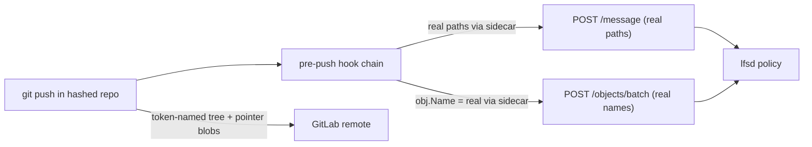

# Directory/file name hiding (the "qe" name-hiding layer)

Self-contained design for hiding file and directory **names** from unauthorized
viewers, extending the existing content- and message-hiding. Records decisions,
not deliberation; the design conversation that produced them lives in chat
history.

## 1. Goals, non-goals, audience

**Goals.** Hide file and directory names in the git repository that lands on the
remote (e.g. GitLab), revealing real names to a user only for the parts of the
tree that user is authorized to read. Do this without changing how the policy
server enforces path-level authorization, and while preserving the git workflow
the project needs: add, commit, push, pull, fetch, merge, branch, rebase
(branching, MRs, and merge-conflict resolution).

**Non-goals.**
- Defending against a determined insider who brute-forces names (see §4).
- Hiding tree *structure* (depth, fan-out), file count, file sizes, object IDs,
  authors, timestamps, or the commit graph. These are accepted leaks (§10).
- Rewriting the reviewer extension to reveal names in the GitLab UI. Deferred
  (§10, §12); MR diffs show token names until then.
- Rename-history preservation. Out of scope (§10).

**Audience.** A developer implementing this feature on top of the existing LFS
policy server (`internal/pep`, `internal/policy`, `internal/ports`) and the
forked git-lfs client (`client-implementation/git-lfs`).

## 2. Background: what is already hidden

Two axes are already covered, both via the principle *whatever lands in git is
visible to everyone; only ship what everyone may see*:

- **Content** — every tracked file is an LFS pointer; real bytes live on the
  server (`lfs-data/<repo>/<oid>`) and are released only by dereferencing the
  pointer through lfsd, gated by `policy.Decide(download, path)`. A denied
  download returns `403`; the forked client (`lfs.skipdownloaderrorcodes=403`)
  leaves the **pointer** in the working tree. "Files a user cannot read remain
  pointer files" (`auth-design.md` §13).
- **Commit messages** — redacted to `[redacted] msg:<oid>`; the real text is
  uploaded at push (`contrib/lfs-msg-push.sh` → `POST /{repo}/message`) and
  served back gated by all-paths download policy.

**The gap:** a file's *name* still leaks through the path of its pointer in the
git tree. Content is safe; the name is not. This feature closes that gap.

## 3. Reveal rule

The committed/remote tree is **uniformly tokenized**; each viewer locally
de-tokenizes only what they are authorized to see.

> A node's real name is revealed to a viewer **iff the viewer may `download`
> something in that node's subtree.**

Consequences:
- Ancestors of an authorized node are always revealed (the authorized subtree
  sits beneath them), so authorized paths render fully.
- Unrelated siblings stay hashed.
- Name visibility == download permission. No new policy semantics.

Example, from Bob's POV (`private/privBob/**` access):
- `private/privBob/bobsecret.txt` → shown in full.
- `private/privAlice/secret.txt` → `private/<hash>/<hash>` (`private` shows via
  privBob; `privAlice` and below stay hashed).

## 4. Threat model and assumptions

- **Adversary:** a casual insider (an authorized user reading names they should
  not) and any reader of the remote repo. We **assume no brute-force**: an
  attacker will not hash candidate names to confirm guesses. As long as
  inverting the hash is non-trivial, this is acceptable.
- **Accepted leaks:** tree structure, file count, per-file size, object IDs,
  authors, timestamps, commit graph.
- **Operational assumption:** users interact only through `qegit` commands;
  raw `git`/`git-lfs` misuse is out of scope.

This assumption is load-bearing: it is what allows a simple one-way hash instead
of per-directory keys or a server-assigned random mapping. If the threat model
ever includes a brute-forcing insider, the token derivation must change (keyed
HMAC or random + server mapping).

## 5. The token

```
token(node) = hex(SHA256(normalized-path-prefix-to-node))   # per path component
```

`private/privBob/bobsecret.txt` →
`SHA("private") / SHA("private/privBob") / SHA("private/privBob/bobsecret.txt")`.

- **Deterministic + unkeyed:** same real path → same token everywhere, so file
  identity and convergence across clones/branches are free, with no keys and no
  server-assigned mapping.
- **One-way:** a viewer cannot invert a token, so reverse lookup needs the
  policy-gated reveal channel (§7).
- **Per component, directories included:** folder names hide too (except the
  authorized chain, §3).
- **Normalization must match the server's** (`auth-design.md` §6.5: split on
  `/`, drop empty segments, reject `..`, case-sensitive). The client tokenizes
  the real paths the server returns, so both sides must normalize identically.
- **Cleartext exceptions:** `.gitattributes` and `.gitignore` stay plaintext
  (git reads them by name); everything else is LFS-tracked and tokenized.
- **Encoding/length:** full 64-hex SHA-256 by default. Path-length limits and
  truncation are deferred (acceptable on Linux/WSL).

## 6. The enabling insight

**The policy server never reads git-committed paths.** It authorizes on the
real path the client supplies out-of-band: `obj.Name` on upload (recorded in
`PathIndex`), the `PathIndex`-verified path on download, and `paths` on message
records. Tokenizing names in git therefore has **zero effect on enforcement**,
provided the client keeps sending real paths — which it already does. This is
what makes the feature tractable without touching the PDP/PEP authorization core.

## 7. Architecture: the two-directory model

One real git repository whose names are tokens and whose files are LFS pointer
stubs (the "hashed" repo, what the remote stores), plus a synced real-named
mirror the human edits (the "legible" workspace).

### 7.1 On-disk layout

```
myproject/              ← LEGIBLE workspace: real names, real bytes (authorized only). User lives here. NOT a git repo.
  .qe/                  ← qe control dir (hidden plumbing)
    hashed/             ← the real git repo: token-named stubs + .git
      .git/
        lfs/objects/    ← the single blob cache (content store)
      a1b2…/c3d4…/…     ← token-named LFS pointer stubs
    config              ← workspace → hashed mapping, lfs.url, etc.
```

- The hashed repo is **skip-smudged**: its working tree is uniformly token-named
  pointer stubs.
- Real content lives once in the legible workspace plus the blob cache
  (`.qe/hashed/.git/lfs/objects`); the hashed working tree holds only stubs.
- The hashed repo lives inside the workspace for now; the tree it exposes is
  fully tokenized, so leaking its existence leaks only a hashed tree.

### 7.2 Invariant

> The hashed repo is the single source of truth for history; the legible
> workspace is a synced projection of the viewer's authorized subtree.

Every `qegit` command follows one pattern:

1. **Sync in:** re-hash legible → overwrite the hashed working tree (authorized
   subtree only).
2. Run the **vanilla** git/git-lfs command in the hashed repo.
3. **Sync out:** regenerate legible from the new hashed state; map output
   token→real for display.

Because git always operates on a self-consistent hashed repo (working tree =
index = HEAD, all tokens), there is no path-equality divergence and therefore no
`clean`/`reset`/`stash` data-loss footgun.

### 7.3 The sidecar map (ephemeral, derived)

A `token-path ⇄ real-path` map is needed by the fork (real `obj.Name` on push),
by `qegit` (renames), and by message binding. Because `token = SHA(realpath)` is
deterministic, the map is **derived, not authoritative**:

- forward (real→token) is computed from legible (your own files) on the fly;
- reverse (token→real) is rebuilt from `/names` (authorized real paths) plus
  recomputed tokens.

`qegit` regenerates it per command and hands it to the fork for that invocation
(e.g. via an env var pointing at a temp file). It is **not** durable state — this
deliberately avoids the orphan/GC drift that a persistent store would reintroduce
(cf. the message cache). The only authoritative reverse source is `/names`.

## 8. Components

In dependency order.

1. **Token function** (new, shared Go package): pure `realPath → tokenPath` and
   the reverse-via-map helper. Normalization matches `auth-design.md` §6.5.
2. **Server reveal endpoint** `GET /{repo}/names`: add
   `PathsInRepo(repo) ([]string, error)` to `internal/ports/pathindex.go` and
   its in-memory impl; new handler in `internal/pep/server.go` that
   authenticates, lists repo paths, filters by `policy.Decide(download, path)`,
   and returns the authorized real paths. Reuses the existing download gate.
3. **Fork: real `obj.Name`** (`client-implementation/git-lfs`): on upload, map
   the tree's token path → real via the sidecar before sending `obj.Name`; on
   download, send an empty name and let the server resolve via `PathIndex`.
4. **Redaction path-binding** (`contrib/redact-commit-msg.sh`,
   `contrib/lfs-msg-push.sh`): bind messages to **real** paths supplied by
   `qegit` (the commit runs in the hashed repo, where staged paths are tokens).
5. **`qegit` engine + command wrappers** (new Go binary): the legible↔hashed
   projection, reveal (`/names` + lfsd download), sidecar generation, and the
   command set (clone, add, commit, push, pull, fetch, status, diff, branch,
   merge, rebase, mv, rm, clean, stash).
6. **Packaging/setup**: `qegit` is the single entrypoint and owns the bundled
   fork; an installer places both binaries + contrib hooks at a stable location
   and `qegit init/clone` wires the repo (replacing the path-wiring in
   `scripts/lfs-setup.sh`).

## 9. How operations work

Worked with Bob and `private/privBob/bobsecret.txt`.

- **clone:** vanilla `git clone` of the hashed repo (token stubs) → `/names` →
  for each authorized path, compute its token path, dereference the pointer via
  lfsd, write real bytes into legible at the real name. Unauthorized files stay
  token stubs in the hashed repo, absent from legible.
- **add:** sync the changed legible bytes into the hashed working tree at the
  token path; `git add <tokenpath>` runs the clean filter → pointer staged.
- **commit:** `qegit` feeds the **real** touched paths to the redaction step,
  which caches the real message under `.git/lfs-msgs/<oid>` and rewrites the
  message to `[redacted] msg:<oid>`; `git commit` records the token-named tree.
- **push (two channels):**



  The git data on the remote is token-named; the policy-relevant names sent to
  lfsd are real. lfsd records `(repo, oid, real-path)` in `PathIndex`.
- **pull/fetch:** vanilla fetch in hashed → re-run `/names` → de-tokenize and
  smudge authorized paths into legible.
- **status/diff:** sync legible into hashed, run vanilla `git status`/`git diff`
  (content via the existing `diff.lfs.textconv` driver), map token paths → real
  for display.
- **branch/merge/rebase:** run in the hashed repo. Content merges via the
  `lfs-text` driver; deterministic tokens make same-file matching across
  branches correct. Conflicts surface in token space and are projected into
  legible (real names) for resolution.

## 10. Git operation support matrix

| Operation | Status | Notes |
| --- | --- | --- |
| add, commit, push, pull, fetch | Supported | Vanilla in hashed; sync + sidecar. |
| branch | Supported | Ref/graph only; no paths. |
| merge, rebase | Supported | Content merge via `lfs-text`; conflicts projected to legible. |
| clean -fd, stash, reset | Supported | Safe — hashed repo is self-consistent (no A-style footgun). |
| mv, rm | Supported | Rename = token delete+add. |
| Rename tracking / `log --follow` | Degraded | `token = SHA(path)`, so renames are delete+add; out of scope. |
| Rename-aware merge | Degraded | Rename detection fails in token space → more manual conflicts around renames. |
| MR review on GitLab | Degraded (deferred) | Diff shows token names + pointers until the reviewer extension also reveals names. |

Accepted leaks: structure, file count, size, OID, authors, timestamps, commit
graph; and any real names embedded in the plaintext `.gitattributes`/`.gitignore`.

## 11. Rejected alternatives

- **A — tokens in the local index/commits, real names in the working tree.**
  Rejected: git has no path-translation hook, so every path-aware command must
  be wrapped; `clean`/`reset --hard`/`stash` become data-loss/leak footguns;
  breaks the existing commit-msg redaction; and the fork token→real change is
  still required anyway.
- **B (naive in-place views) — FUSE / symlink farm / editing token names.**
  Rejected: FUSE is heavy and platform-specific; symlink farms break on editor
  save and interact badly with smudge; token-named files are unnavigable. The
  two-directory model is the salvaged form of B.
- **C — real names local, tokenize only at push via a remote helper.**
  Rejected: requires rewriting the commit graph on every transfer (new SHAs,
  parents, merges, tags, a SHA mapping) and dangerously couples that rewrite to
  the authorization write path (`obj.Name`/`PathIndex` bindings), for a benefit
  (real-named local history) the threat model does not need.

## 12. Security considerations

- **Reveal == download permission.** `/names` and the content/message gates use
  the same `policy.Decide(download, path)`, so a user learns a name exactly when
  they could read the bytes. Fail-closed: unknown/denied paths stay tokens.
- **SF-1 unaffected.** Tokenizing names neither fixes nor worsens the
  cross-path OID binding weakness (`security-findings.md` SF-1); the OID still
  sits in the (now token-named) pointer, and a token-named pointer reveals
  strictly less than a real-named one.
- **Brute-force is out of scope** per §4; if that changes, the token derivation
  must move to keyed HMAC or random + server mapping.

## 13. Deferred

| Item | Why deferred |
| --- | --- |
| Reviewer extension name reveal | Get directory hiding working first; MR diffs show tokens until then. |
| Token length / path-limit handling | Full 64-hex is fine on Linux/WSL. |
| Rename history / rename-aware merge | Not a current requirement. |
| Persistent sidecar cache | Start with on-the-fly derivation; add only if profiling demands. |
| OS-package / Homebrew distribution | Tarball + installer first; richer packaging later. |
