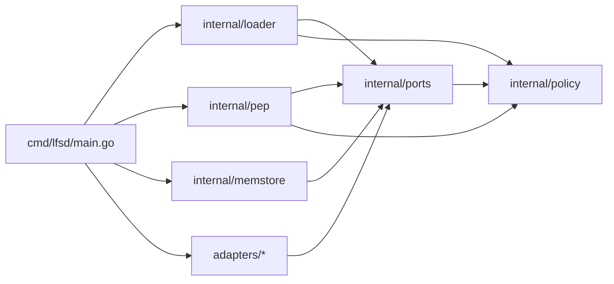

# Server scaffold: repo, libraries, layout, testing

Self-contained decision record for how the custom LFS server is brought up: where it lives, what it is built on, how its packages are arranged, and how it is tested. Companion to [docs/proposals/auth-design.md](docs/proposals/auth-design.md), which settles the authorization subsystem inside the server.

This doc records decisions, not deliberation. The conversation that produced these decisions lives in chat history.

## 1. Goals, non-goals, audience

**Goals.** Settle four scaffold decisions before any server code is written:

1. Where the server code lives (which repository).
2. The HTTP runtime and core libraries.
3. The Go package layout that enforces the dependency direction in [docs/proposals/auth-design.md](docs/proposals/auth-design.md) section 2.2.
4. The testing strategy across pure, component, and integration layers.

**Non-goals.** This doc does not cover:

- The PDP, PEP, Verifier, or Loader internals. See [docs/proposals/auth-design.md](docs/proposals/auth-design.md).
- Production adapter design (Postgres, S3, OAuth, OTel). One follow-up doc per adapter.
- CI/CD pipelines, container images, Helm charts, deployment targets.
- Pre-receive hook design. See [docs/proposals/components.md](docs/proposals/components.md) section 6.

**Audience.** A developer about to create the server repository and begin implementing it from auth-design section 14 step 1.

## 2. Decision 1: separate repository

The server lives in its own repository, working name `git-lfs-server`. Not in this fork; not as a subdirectory; not as a nested Go module.

### 2.1 Rationale

| Driver | Separate repo cost | This-fork cost |
| --- | --- | --- |
| Upstream rebases of the client fork | Zero | Every rebase must be aware of server-only code |
| Module dependency surface | Server pulls nothing from client | Client module transitively imports DB drivers, S3 SDK, OTel |
| Release cadence | Independent | Coupled to client releases |
| Review groups, secrets, deploy targets | Separate by default | Have to be carved out of a repo that does not otherwise need them |
| Cross-repo integration tests | Need a thin shim | None needed |

The dependency surface row is the deciding factor. The auth subsystem is one slice of the server; ObjectStore, identity, and audit each bring their own production dependencies. None of that belongs anywhere near the client.

### 2.2 What is not shared

- No vendored copy of upstream `git-lfs/git-lfs` packages. The server speaks the LFS Batch API at the JSON wire level; it does not import client packages.
- No build-time dependency on this fork in either direction.
- No shared CI configuration. Each repo configures its own.

### 2.3 What might be shared later

If the LFS Batch JSON shape starts being duplicated, extract a tiny `github.com/<org>/lfs-protocol` package (a few struct definitions, no behavior). Not v1. Wait until duplication actually appears.

### 2.4 Repository metadata

| Item | Value |
| --- | --- |
| Working name | `git-lfs-server` |
| Module path | `github.com/<org>/git-lfs-server` |
| Default branch | `main` |
| Go version | latest stable at repo creation; pinned in `go.mod` |
| License | Same as this fork (confirmed at repo creation) |
| README | Points back to this fork's design docs as the authoritative spec |

## 3. Decision 2: runtime and libraries

Locked-in choices. No alternatives table per item; that conversation happened.

| Concern | Choice | Why |
| --- | --- | --- |
| HTTP server | `net/http` stdlib | Go 1.22+ routing is sufficient; matches the handler signatures in [docs/proposals/auth-design.md](docs/proposals/auth-design.md) section 8.3; trivially testable via `httptest` |
| Router (optional) | `go-chi/chi` only if stdlib routing becomes painful | Preserves stdlib `http.HandlerFunc` shape; no `Context` leak |
| Frameworks | None | No Gin, Echo, Fiber. Their `Context` types couple handlers to the framework and break the swappable-adapter story |
| Logging | `log/slog` stdlib | Structured, performant, zero deps |
| JSON | `encoding/json` stdlib | Only revisit if profiling proves it is the bottleneck (it will not be) |
| Config | stdlib `flag` + env vars wrapped in `config.Load()` | No Viper. Server config is small; a hundred lines covers it |
| Errors | stdlib `errors` + `fmt.Errorf("%w", ...)` | No `pkg/errors` |
| Testing | stdlib `testing`, table-driven | Matches [docs/proposals/auth-design.md](docs/proposals/auth-design.md) section 12.1 |
| Test helpers | `testify/require` only if `t.Fatalf` boilerplate becomes painful | Quarantined to `*_test.go` files |
| Pre-signed URLs (deferred) | `aws-sdk-go-v2/service/s3` | Lives only inside `adapters/s3/`. Never imported elsewhere |
| Postgres driver (deferred) | `jackc/pgx/v5` | Lives only inside `adapters/postgres/`. Never imported elsewhere |
| OAuth (deferred) | TBD at adapter-design time | Lives only inside `adapters/oauth/` |
| OTel (deferred) | `go.opentelemetry.io/otel` | Lives only inside `adapters/otel/` |

### 3.1 The hard rule about framework types

> **No framework type ever appears in a function signature outside its own adapter package.**

Stdlib types (`http.Request`, `context.Context`, `slog.Logger`) are fine. Anything beyond them -- an SDK client, a database connection, a router-specific context -- is confined to its adapter package and never leaks into the PEP, PDP, Loader, or any other consumer.

The compiler enforces this if adapters live in separate packages. Section 4 lays out the boundaries that make it impossible to violate accidentally.

## 4. Decision 3: package layout

Literal translation of the dependency direction diagram in [docs/proposals/auth-design.md](docs/proposals/auth-design.md) section 2.2.

### 4.1 The tree

```text
git-lfs-server/
├── go.mod
├── README.md
├── cmd/
│   └── lfsd/
│       └── main.go              # ONLY file that names production adapters
├── internal/
│   ├── policy/                  # pure: Subject, Action, Decision, PDP Decide, segment trie
│   ├── ports/                   # ALL interfaces; imports only ./policy
│   │   └── portstest/           # interface compliance suites
│   ├── loader/                  # depends on ports.PolicyStore + policy
│   ├── pep/                     # HTTP handlers; depends only on ports + policy
│   └── memstore/                # v1 in-memory adapters
├── adapters/                    # production adapters (one PR each, deferred)
│   ├── postgres/                # PostgresPathIndex
│   ├── s3/                      # S3ObjectStore
│   ├── oauth/                   # OAuthAuthenticator
│   └── otel/                    # OTelAuditSink
└── tests/
    ├── e2e/                     # Go-level black-box: httptest.Server + memstore
    └── shell/                   # t/t-auth-*.sh style; invokes the lfsd binary
```

### 4.2 The four DIP-enforcing invariants



1. **`internal/policy` imports nothing from the tree.** It is a leaf. Pure types and pure functions.
2. **`internal/ports` imports only `internal/policy`.** Interface declarations plus the value types those interfaces reference. Never any adapter.
3. **`internal/pep`, `internal/loader`, `internal/memstore`, `adapters/*` depend on `internal/ports`, never on each other.** Sibling packages with no horizontal edges. The compiler refuses to build a horizontal import.
4. **`cmd/lfsd/main.go` is the only file that imports `memstore/` and `adapters/*` together.** The constructor lives here. Every other file sees only interfaces.

### 4.3 Why `internal/`

Go's `internal/` rule blocks external imports. Desired: no third party should depend on the PEP, the PDP internals, or the in-memory adapters. The only external surface is the binary itself plus, eventually, the future `lfs-protocol` package.

`adapters/` sits outside `internal/` deliberately. Once production adapters land, the option is open to publish a single adapter as a reusable component without making the whole server importable. v1 does not exercise this.

### 4.4 Where each auth-design component lands

| Auth-design component | Package |
| --- | --- |
| Types (`Subject`, `Request`, `Decision`, `Policy`, ...) | `internal/policy` |
| PDP `Decide` function | `internal/policy` |
| Segment trie | `internal/policy` |
| `Authenticator`, `PathIndex`, `PolicyStore`, `AuditSink`, `ObjectStore` interfaces | `internal/ports` |
| Loader | `internal/loader` |
| `InMemoryAuthenticator`, `InMemoryPathIndex`, `FilePolicyStore`, `StringPolicyStore`, `StderrAuditSink` | `internal/memstore` |
| PEP: adapter, authenticate, verifier, decider, enforcer | `internal/pep` |
| `VerifyDownloadClaim` helper | `internal/pep` |

## 5. Testability strategy

Five layers, identical in spirit to [docs/proposals/auth-design.md](docs/proposals/auth-design.md) section 12. Restated here for the server as a whole; the auth doc covers the auth-specific slice.

### 5.1 Layers

| Layer | Lives in | Scope | Speed |
| --- | --- | --- | --- |
| Pure unit | `internal/policy/*_test.go` | PDP, trie, normalization | ms |
| Component | `internal/{pep,loader,memstore}/*_test.go` | One package at a time, in-memory adapters from `internal/memstore` | seconds |
| Black-box e2e | `tests/e2e/` | `httptest.NewServer` wired to all in-memory adapters; real HTTP | seconds |
| Shell integration | `tests/shell/*.sh` | `lfsd` binary as subprocess; style of [t/t-auth-read.sh](t/t-auth-read.sh) and [t/t-auth-write.sh](t/t-auth-write.sh) | seconds |
| Adapter (deferred) | `adapters/<backend>/*_test.go` with `//go:build integration` | Real Postgres / S3 / OAuth / OTel in containers | minutes |

The first four require zero external services. The fifth runs on a separate CI lane and never blocks core work.

### 5.2 Interface compliance suites

`internal/ports/portstest/` exports a function per interface:

```go
// Shape, not final code.
package portstest

func RunPathIndexContract(t *testing.T, factory func() ports.PathIndex)        { ... }
func RunAuthenticatorContract(t *testing.T, factory func() ports.Authenticator) { ... }
// ... one per interface ...
```

Every adapter -- in-memory and production -- calls the suite:

```go
// Shape, not final code.
// internal/memstore/pathindex_test.go
func TestPathIndexContract(t *testing.T) {
    portstest.RunPathIndexContract(t, func() ports.PathIndex {
        return memstore.NewInMemoryPathIndex()
    })
}

// adapters/postgres/pathindex_test.go
//go:build integration
func TestPathIndexContract(t *testing.T) {
    portstest.RunPathIndexContract(t, func() ports.PathIndex {
        return postgres.NewPathIndex(testDB(t))
    })
}
```

Same suite, two backends, identical guarantees. Roughly 50 lines per interface. Pays for itself the first time a production adapter ships.

### 5.3 testdata convention

Co-located with the package that uses it, not centralized:

```text
internal/loader/testdata/
├── valid/
│   ├── minimal.json
│   ├── with-groups.json
│   └── ...
└── invalid/
    ├── unknown-version.json
    ├── bad-action.json
    └── ...
```

Tests walk `testdata/` via `os.ReadDir`, sub-test via `t.Run(filename, ...)`. New cases land by dropping a file in -- no test code change.

### 5.4 e2e wiring helper

A single helper in `tests/e2e/` mirrors the production `main.go` constructor with adapters swapped one-for-one:

```go
// Shape, not final code.
func newTestServer(t *testing.T) (url string, cleanup func()) {
    srv, _ := pep.NewServer(
        memstore.NewInMemoryAuthenticator(testUsers),
        memstore.NewInMemoryPathIndex(),
        memstore.NewStringPolicyStore(testPolicyJSON),
        memstore.NewStderrAuditSink(),
        memstore.NewLocalFSObjectStore(t.TempDir()),
    )
    ts := httptest.NewServer(srv)
    return ts.URL, ts.Close
}
```

Used by every black-box e2e test. The fact that this helper is one-to-one with `main.go` is the daily proof that DIP is paying off.

## 6. Initial repo bring-up

A numbered checklist, no dates. Each step is its own small PR:

1. Create the repository. Set default branch `main`. Add `LICENSE` (matching this fork) and a `README.md` whose body points to this fork's [docs/proposals/auth-design.md](docs/proposals/auth-design.md) and `docs/proposals/server-scaffold.md` as the authoritative spec.
2. `go mod init github.com/<org>/git-lfs-server`. Pin Go version in `go.mod`.
3. Skeleton directories with `doc.go` stubs only -- no behavior. The tree from section 4.1 minus the `adapters/*` subdirectories (those land later, one per PR).
4. Baseline CI: `go vet ./...`, `go test ./...`, `staticcheck ./...`. Single workflow file. No test gates yet because there are no tests.
5. First behavioral PR: [docs/proposals/auth-design.md](docs/proposals/auth-design.md) section 14 step 1 -- the pure types in `internal/policy`. Compile-only tests.
6. Subsequent PRs follow auth-design section 14 in order. Each PR reviewable on its own.

## 7. What's explicitly deferred

| Item | Why deferred | When to revisit |
| --- | --- | --- |
| Production adapters (Postgres, S3, OAuth, OTel) | Each is a separate per-adapter design doc and PR. Not blocking core development. | After the core lands and is exercised by in-memory adapters. |
| Container image and deployment pipeline | No deploy target yet. Image builds add CI complexity that does not help core development. | When the first staging deploy is needed. |
| Helm chart / Kubernetes manifests | Same reason. | When deploy target is fixed. |
| Shared `lfs-protocol` Go package | Premature; no duplication exists yet. | When wire types start being copy-pasted between repos. |
| Multi-tenancy | Out of scope for v1. | Future product decision. |
| Go workspace (`go.work`) joining this fork and `git-lfs-server` | Cross-repo dev convenience; not required for either repo to build. | If a contributor regularly needs to edit both at once. |
| Release pipeline, signed binaries, SBOM | Not blocking core development. | At first external release. |
